# AWS CLI - Laboratório de Instalação e Configuração

Este repositório contém um guia prático para instalação e configuração da AWS CLI em uma instância Red Hat Linux no Amazon EC2.

## 📁 Estrutura do Repositório

```
aws-cli-lab-guide/
├── README.md                     # Este guia principal
├── images/                       # Capturas de tela do laboratório
│   ├── aws-architecture-diagram.png
│   ├── ssh-connection.png
│   ├── download-awscli.png
│   ├── install-awscli-1.png
│   ├── install-awscli-2.png
│   ├── aws-console-iam.png
│   ├── aws-help.png
│   ├── iam-commands.png
│   ├── list-policies.png
│   └── policy-json.png
├── scripts/                      # Scripts auxiliares
│   ├── install-awscli.sh        # Script automatizado de instalação
│   └── configure-cli.sh         # Script de configuração
└── docs/                        # Documentação adicional
    ├── troubleshooting.md       # Guia de resolução de problemas
    └── advanced-commands.md     # Comandos avançados da AWS CLI
```

## 📋 Visão Geral

Este laboratório ensina como:
- Instalar a AWS CLI em uma instância Red Hat Linux
- Configurar credenciais de acesso
- Conectar a CLI a uma conta AWS
- Utilizar comandos básicos do IAM via CLI

## 🏗️ Arquitetura

```
┌─────────────────────────────────────────────┐
│                AWS Cloud                    │
│  ┌─────────────────────────────────────┐   │
│  │               VPC                   │   │
│  │  ┌─────────────────────────────┐   │   │
│  │  │     Red Hat EC2 Instance    │   │   │
│  │  │                             │   │   │
│  │  │      ┌─────────────┐       │   │   │
│  │  │      │  AWS CLI    │ ◄─────┼───┼───┼── SSH Connection
│  │  │      └─────────────┘       │   │   │
│  │  │                             │   │   │
│  │  └─────────────────────────────┘   │   │
│  └─────────────────────────────────────┘   │
│                    │                        │
│         ┌─────────────────────┐             │
│         │        IAM          │             │
│         └─────────────────────┘             │
└─────────────────────────────────────────────┘
```

## 🎯 Objetivos de Aprendizado

Ao final deste laboratório, você será capaz de:
- ✅ Instalar e configurar a AWS CLI
- ✅ Conectar a AWS CLI a uma conta AWS
- ✅ Acessar serviços IAM usando a AWS CLI
- ✅ Executar comandos básicos de gerenciamento

## ⏱️ Duração Estimada
**45 minutos**

## 🚀 Pré-requisitos

- Acesso ao AWS Management Console
- Instância EC2 Red Hat Linux em execução
- Chaves de acesso AWS (Access Key ID e Secret Access Key)
- Cliente SSH (PuTTY para Windows ou terminal para macOS/Linux)

## 📝 Roteiro do Laboratório

### Tarefa 1: Conectar à Instância EC2

#### Para Usuários Windows:
1. Baixe o arquivo `.ppk` das credenciais do laboratório
2. Configure o PuTTY com o IP público da instância
3. Conecte-se via SSH usando a chave privada

#### Para Usuários macOS/Linux:
```bash
# Baixar o arquivo .pem
chmod 400 labsuser.pem

# Conectar via SSH
ssh -i labsuser.pem ec2-user@<IP-PÚBLICO>
```

### Tarefa 2: Instalar AWS CLI

Execute os seguintes comandos no terminal da instância:

```bash
# 1. Baixar o instalador da AWS CLI
curl "https://awscli.amazonaws.com/awscli-exe-linux-x86_64.zip" -o "awscliv2.zip"

# 2. Descompactar o arquivo
unzip -u awscliv2.zip

# 3. Executar o instalador
sudo ./aws/install

# 4. Verificar a instalação
aws --version
```

### Tarefa 3: Configurar AWS CLI

```bash
# Executar configuração
aws configure
```

**Dados necessários:**
- **Access Key ID**: Obtido do painel de detalhes do laboratório
- **Secret Access Key**: Obtido do painel de detalhes do laboratório  
- **Região padrão**: `us-west-2`
- **Formato de saída**: `json`

### Tarefa 4: Testar a Configuração

```bash
# Listar usuários IAM
aws iam list-users
```

## 🎯 Desafio Prático

**Objetivo**: Baixar a política `lab_policy` em formato JSON usando apenas a AWS CLI.

### Dicas para o Desafio:

1. **Listar políticas locais**:
```bash
aws iam list-policies --scope Local
```

2. **Obter versão específica da política**:
```bash
aws iam get-policy-version --policy-arn <ARN-DA-POLÍTICA> --version-id <VERSÃO> > lab_policy.json
```

### Solução do Desafio:

```bash
# Passo 1: Listar políticas gerenciadas pelo cliente
aws iam list-policies --scope Local

# Passo 2: Baixar a política lab_policy
aws iam get-policy-version --policy-arn arn:aws:iam::038946776283:policy/lab_policy --version-id v1 > lab_policy.json
```

## 📸 Capturas de Tela do Processo

### 1. Tela Inicial
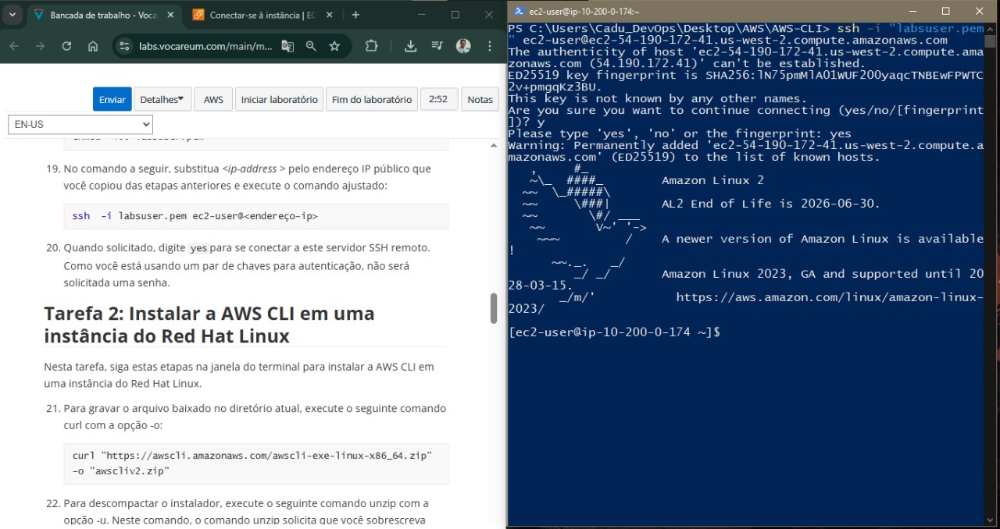
*Tela inicial do ambiente de configuração*

### 2. Configuração Inicial
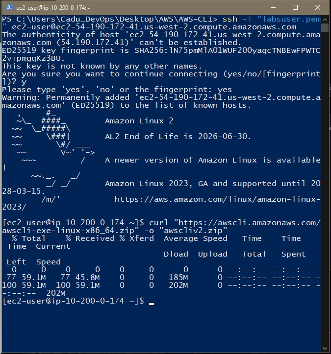
*Configurações iniciais do ambiente*

### 3. Configuração de Rede
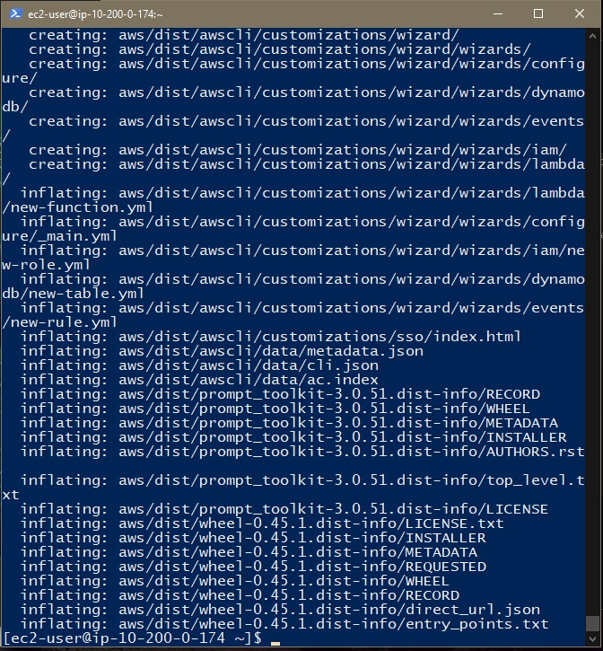
*Configurações de rede da instância*

### 4. Armazenamento
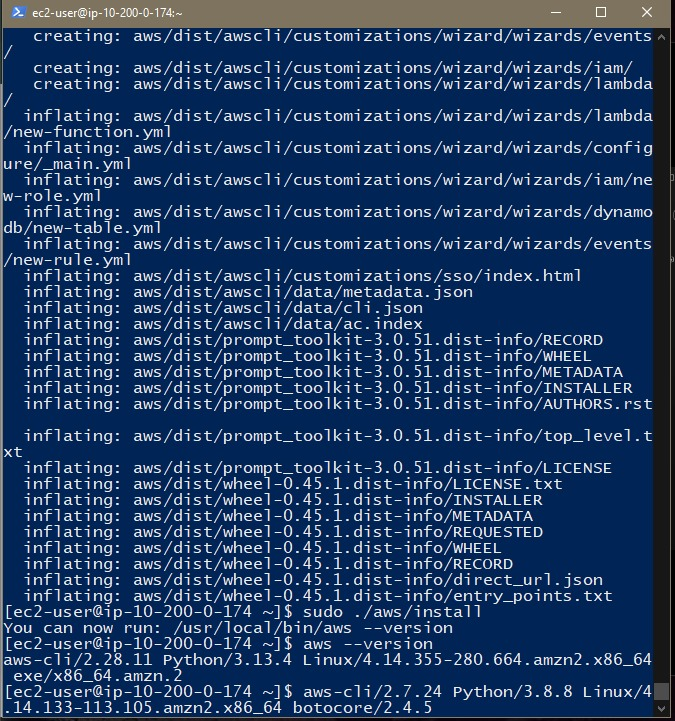
*Configurações de armazenamento*

### 5. Tags
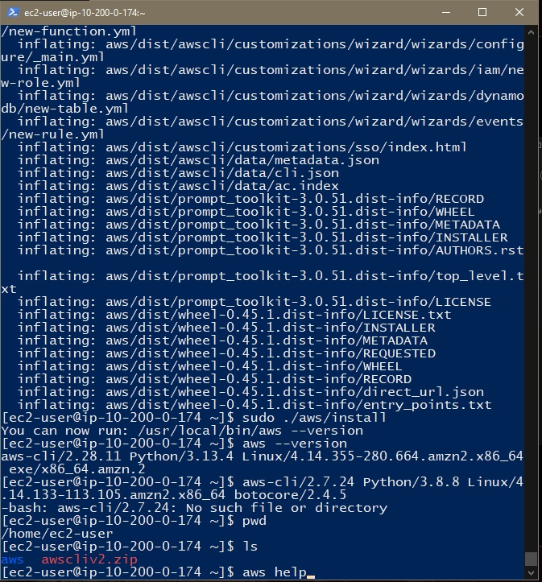
*Configuração de tags*

### 6. Grupos de Segurança
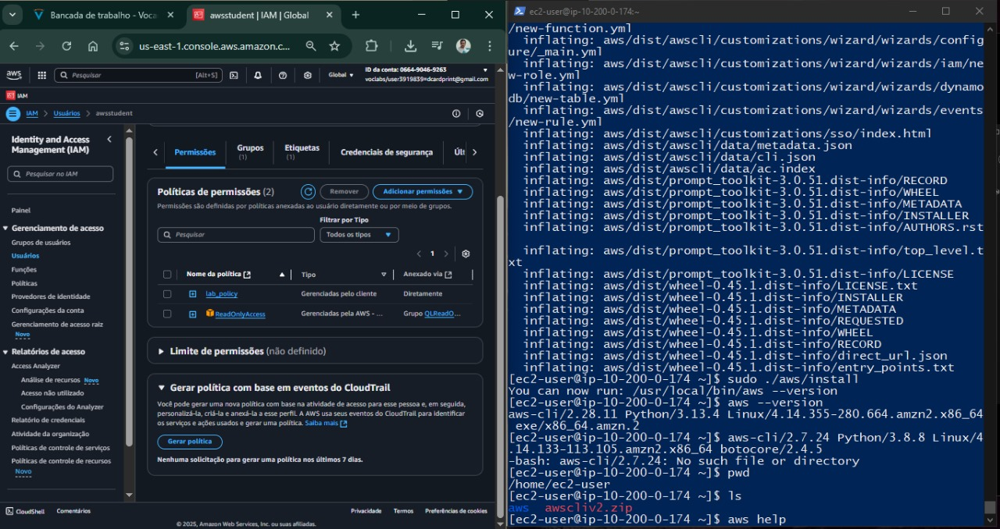
*Configuração de grupos de segurança*

### 7. Revisão
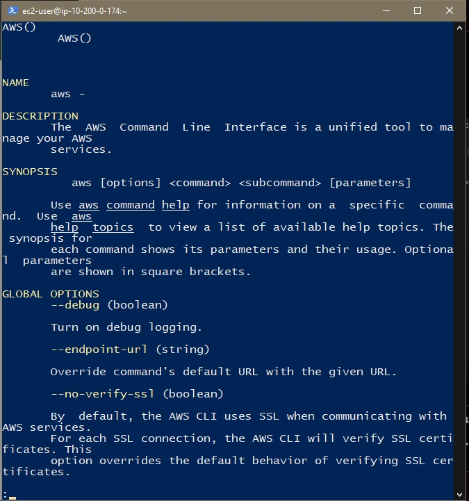
*Tela de revisão das configurações*

### 8. Par de Chaves
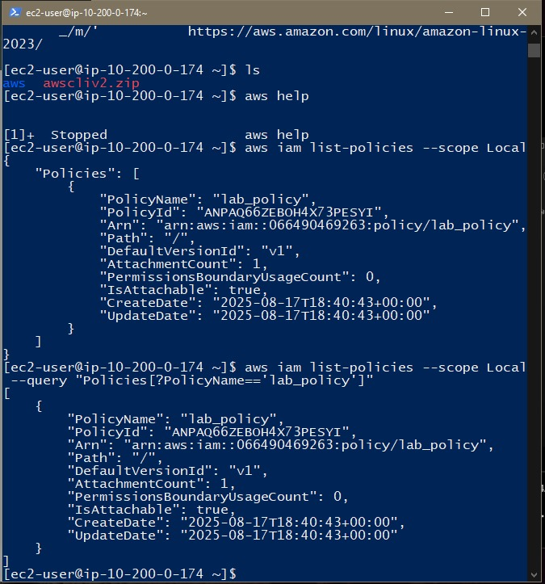
*Criação de par de chaves*

### 9. Instância em Execução
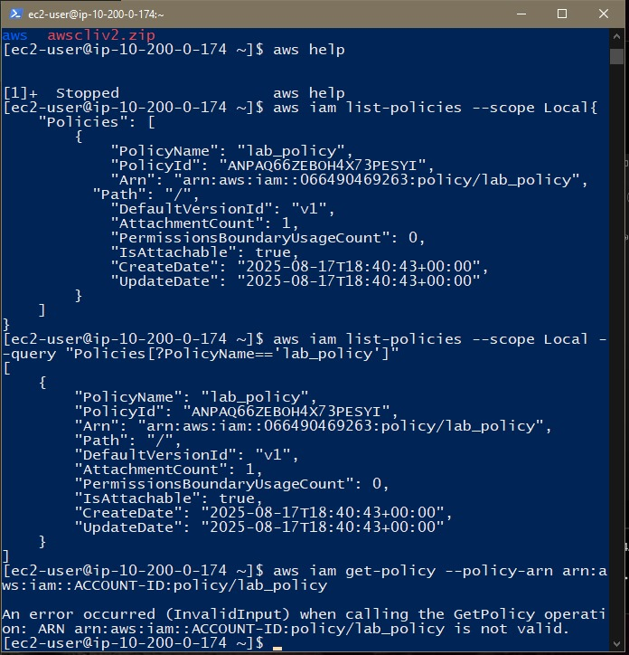
*Instância em execução no console*

### 10. Detalhes da Instância
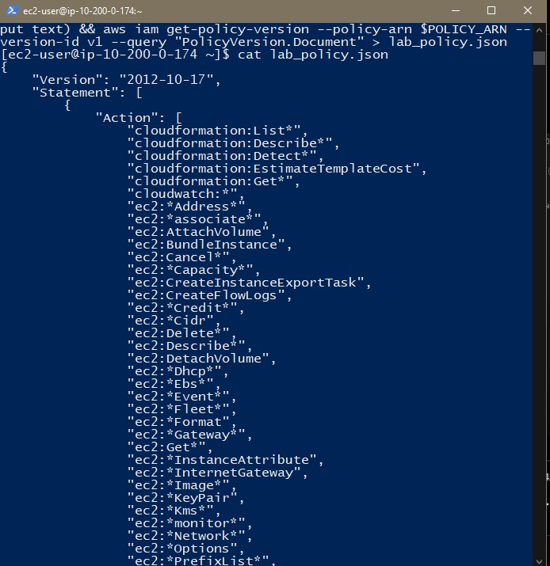
*Detalhes da instância em execução*

### 11. Status da Instância
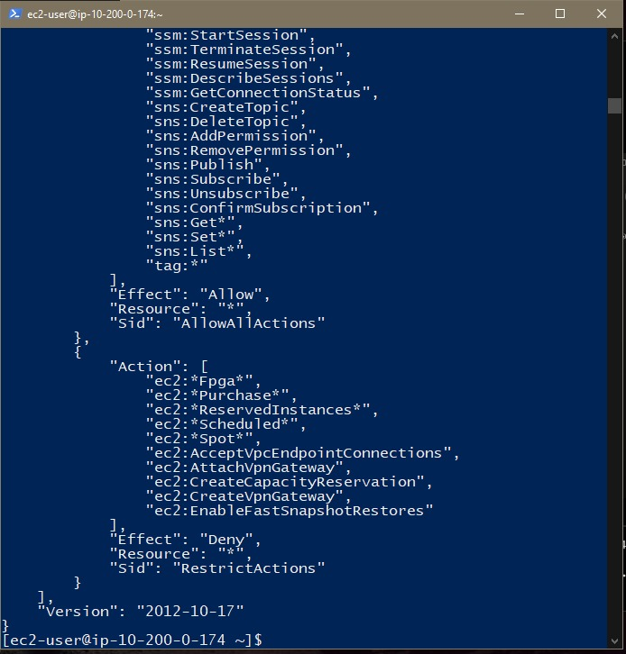
*Status detalhado da instância*

### 12. Arquitetura do Laboratório

*Diagrama da arquitetura do laboratório mostrando VPC, instância EC2 e conexão SSH*

### 13. Conexão SSH e Acesso à Instância

*Estabelecendo conexão SSH com a instância Red Hat EC2*

### 14. Download e Instalação da AWS CLI

*Download do arquivo de instalação da AWS CLI usando curl*


*Processo de descompactação e instalação da AWS CLI*


*Instalação completa com verificação de versão*

### 15. Interface do AWS Management Console

*Interface do AWS Management Console mostrando configurações do IAM*

### 16. Configuração da AWS CLI

*Visualizando a documentação de ajuda da AWS CLI*

### 17. Comandos IAM via CLI

*Executando comandos do IAM via AWS CLI*


*Listando políticas do IAM usando aws iam list-policies*


*Visualizando o conteúdo da política lab_policy em formato JSON*

## ✅ Verificação de Sucesso

Ao final do laboratório, você deve conseguir:
- Executar `aws --version` e ver a versão instalada
- Executar `aws iam list-users` e obter resposta JSON
- Baixar políticas IAM em formato JSON
- Navegar pela documentação da AWS CLI

## 🔧 Comandos Úteis de Referência

```bash
# Verificar configuração atual
aws configure list

# Obter informações do usuário atual
aws sts get-caller-identity

# Listar todas as políticas
aws iam list-policies

# Obter ajuda sobre comandos
aws iam help
aws iam list-policies help
```

## 📚 Recursos Adicionais

- [Documentação oficial da AWS CLI](https://docs.aws.amazon.com/cli/)
- [Referência de comandos IAM](https://docs.aws.amazon.com/cli/latest/reference/iam/)
- [Guia de configuração da AWS CLI](https://docs.aws.amazon.com/cli/latest/userguide/cli-configure-quickstart.html)

## 🏆 Conclusão

Parabéns! Você concluiu com sucesso:
- ✅ Instalação da AWS CLI em Red Hat Linux
- ✅ Configuração de credenciais AWS  
- ✅ Conexão da CLI com conta AWS
- ✅ Execução de comandos IAM via CLI
- ✅ Download de políticas em formato JSON

A AWS CLI é uma ferramenta poderosa que permite automatizar e gerenciar recursos AWS através da linha de comando, proporcionando maior eficiência em operações de DevOps e administração de infraestrutura.

## 📋 Troubleshooting

### Problemas Comuns

#### 1. Erro de Permissão na Instalação
```bash
# Se encontrar erro de permissão, use sudo
sudo ./aws/install
```

#### 2. Comando não Encontrado
```bash
# Verificar se o PATH está correto
which aws
export PATH=$PATH:/usr/local/bin
```

#### 3. Credenciais Inválidas
```bash
# Reconfigurar credenciais
aws configure
# Ou verificar configuração atual
aws configure list
```

#### 4. Erro de Região
```bash
# Definir região específica para comando
aws iam list-users --region us-west-2
```

## 📝 Notas Importantes

- **Segurança**: Nunca compartilhe suas chaves de acesso AWS
- **Região**: Mantenha consistência na região configurada
- **Versionamento**: A AWS CLI é atualizada frequentemente
- **Documentação**: Use `aws help` para obter ajuda contextual

## 🤝 Como Contribuir

Contribuições são bem-vindas! Para contribuir com este projeto:

1. **Fork** este repositório
2. Crie uma **branch** para sua feature (`git checkout -b feature/nova-funcionalidade`)
3. **Commit** suas mudanças (`git commit -m 'Adiciona nova funcionalidade'`)
4. **Push** para a branch (`git push origin feature/nova-funcionalidade`)
5. Abra um **Pull Request**

### Tipos de Contribuições
- 📝 Melhorias na documentação
- 🐛 Correções de bugs
- ✨ Novas funcionalidades
- 🖼️ Atualizações de imagens
- 🔧 Scripts auxiliares

## 📄 Licença

Este projeto está licenciado sob a [MIT License](LICENSE) - veja o arquivo LICENSE para detalhes.

## 👥 Autores

- **Seu Nome** - *Trabalho inicial* - [@seu-usuario](https://github.com/seu-usuario)

## 🔗 Links Úteis

- [AWS CLI Installation Guide](https://docs.aws.amazon.com/cli/latest/userguide/getting-started-install.html)
- [AWS CLI Configuration](https://docs.aws.amazon.com/cli/latest/userguide/cli-configure-files.html)
- [IAM CLI Reference](https://awscli.amazonaws.com/v2/documentation/api/latest/reference/iam/index.html)
- [AWS CLI Examples](https://docs.aws.amazon.com/cli/latest/userguide/cli-usage-examples.html)
